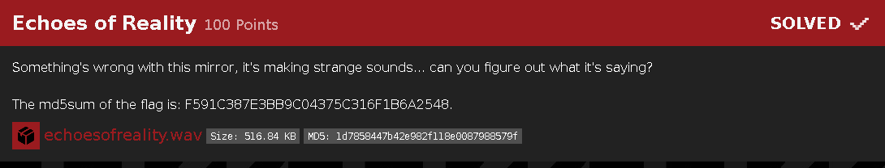
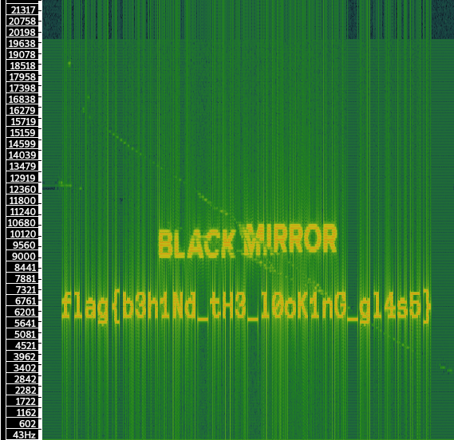

# Echoes of Reality

Misc

## Challenge

## Solution
challenge was quite easy and direct opening the file in sonic visualizer gives us the flag hidden in the spectogram

## flag: flag{b3h1Nd_tH3_l0ok1nG_gl4s5}
