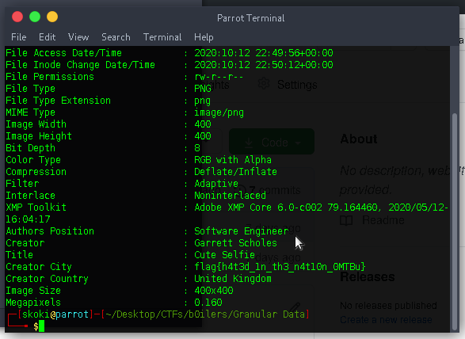

# Granular Data
Misc

## Challenge


## Solution

also an easy challenge 
the flag was hidden in metadata/exifdata

```exiftool Garrett.png```
gives the flag 



##flag : flag{h4t3d_1n_th3_n4t10n_0MTBu}