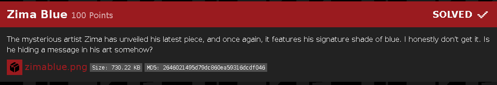
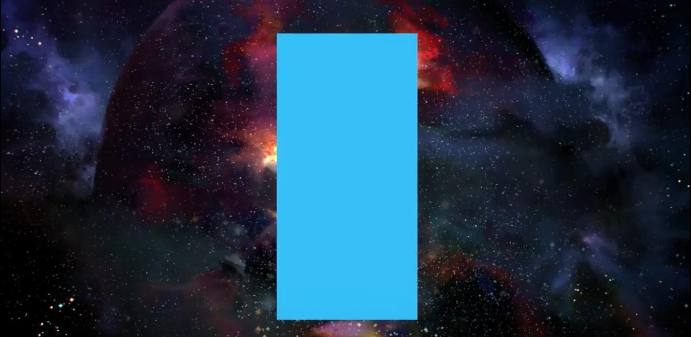
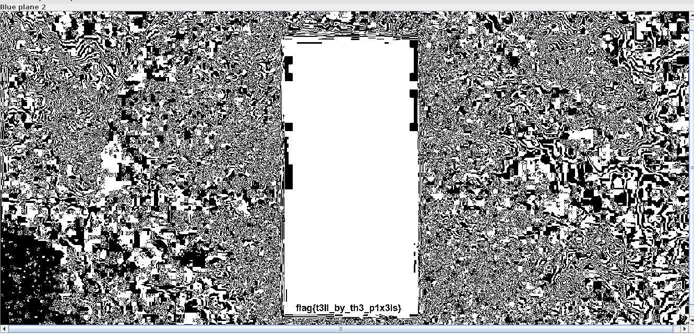

# Zima Blue
Misc/Steg

points 100

 

## Challenge

## Solution

This was an interesting Stega challenge,
opening the file in Stegsolve gives us the flag in plain text 

##flag : flag{t3ll_by_th3_p1x3ls}